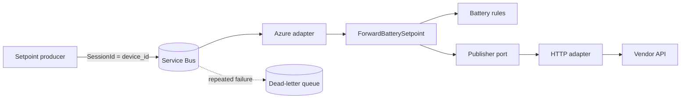

# Battered Batteries setpoint forwarder

TypeScript Azure Functions v4 service that consumes ordered battery commands from Azure Service Bus and forwards them to a vendor HTTP API. The source uses a small DDD bounded context with ports and adapters. Terraform examples and Azure DevOps pipelines describe a proposed development-to-production delivery design.

**Status:** source and safe automated tests are implemented. Terraform and pipelines are deployment examples requiring company-specific configuration. Running tests does not create Azure resources or send real battery commands.



## Design documents

| Document | Contents |
| --- | --- |
| [Architecture](docs/architecture.md) | Domain model, dependencies, composition, processing and failure diagrams |
| [Development and testing](docs/development-and-testing.md) | Local setup, tests shared with CI, cloud acceptance scenarios |
| [Deployment and CI/CD](docs/deployment-and-cicd.md) | Terraform ownership, Azure execution, pipeline setup, promotion and rollback |
| [Operations](docs/operations.md) | Activation, monitoring, incidents and production decisions |
| [Terraform instructions](infra/terraform/README.md) | State, inputs, commands and permissions |

## Folder layout

```text
src/
  domain/battery/                Commands, immutable setpoints and business rules
  application/ports/             Publisher and logger interfaces
  application/use-cases/         ForwardBatterySetpoint
  infrastructure/http/          Axios, retries and vendor payload mapping
  infrastructure/messaging/     Wire decoding and ordered batch handling
  interfaces/azure-functions/   Trigger registration
  bootstrap/                    Configuration and dependency construction
  index.ts                      Runtime entry point
tests/
  unit/domain/                  Business invariants
  unit/application/             Use cases with fake ports
  unit/infrastructure/          Mapping, filtering, retry and ordering regressions
  integration/                  Real HTTP against a loopback mock
  architecture/                 Dependency-direction checks
dev/                            Local mock vendor
scripts/                        Packaging and Terraform installer
infra/bootstrap/                Optional remote-state provisioning
infra/terraform/                Service infrastructure and environment examples
pipelines/                      Release and infrastructure pipeline examples
docs/                           Mermaid design diagrams and runbooks
azure-pipelines.yml             CI validation and application artifact
```

## Verify locally

Use Node.js 24, selected by `.nvmrc` and CI:

```sh
npm ci
npm run check
```

On Windows PowerShell use `npm.cmd` if execution policy blocks `npm.ps1`.

| Command | Purpose |
| --- | --- |
| `npm run build` | Clean generated `dist/` and compile source |
| `npm test` | All safe automated tests |
| `npm run test:unit` | Domain, application and adapter tests |
| `npm run test:integration` | Real HTTP tests without Azure |
| `npm run test:architecture` | Enforce source dependency rules |
| `npm run test:ci` | Same tests plus JUnit results |
| `npm run check` | Build, test type-checking and all safe tests |
| `npm run typecheck:tests` | Type-check tests and test configuration |
| `npm run dev:vendor` | Start local mock on port 7072 |
| `npm run package` | Stage a deployable package after building |
| `npm start` | Build and start Functions Core Tools with configured development services |

## Message contract

```json
{
  "device_id": "BB00001",
  "setpoint": { "value": 1, "unit": "kW", "endTime": "2025-01-01T10:01:00.000Z" },
  "eventTime": "2025-01-01T10:00:00.000Z"
}
```

The producer sets `SessionId=device_id`. The queue is `sbq-batbat-spt` with sessions enabled.

| Input | Output rule |
| --- | --- |
| Grid power in kW | Multiply by -1000 and round to battery watts |
| Original time interval | Duration between one minute and one hour |
| Device ID | Vendor path `/{deviceId}/setpoint` |
| Processing clock | Start at current epoch seconds + 2 |
| Duration | End at new start time + original duration |

The vendor body is `{ "data": { "startTime": ..., "endTime": ..., "value": ... } }`. Only HTTP 204 succeeds. Network errors, 429 and 5xx get up to three attempts, each with an 8-second timeout. Backoff includes jitter; `Retry-After` is capped at 5 seconds. Other statuses fail immediately inside the client, while the broker can still redeliver the invocation.

Unknown devices are logged and skipped. Other invalid input fails the invocation. Batches run sequentially with automatic completion after success. Delivery remains **at least once**; successful HTTP effects may repeat. Expiry and strict idempotency are not implemented. The refactor also rejects power values that cannot safely convert to integer watts and explicitly caps batches at five messages.

## Configuration migration

The trigger setting name changed from `CONNECTION-STRING-SBQ-BATBAT-SPT` to `ServiceBusConnection`. Update existing local or Azure configuration when adopting this version.

- Local connection string: `ServiceBusConnection`.
- Azure identity connection: `ServiceBusConnection__fullyQualifiedNamespace` and `ServiceBusConnection__credential`.
- Vendor settings: `BATTERED_BATTERIES_API_KEY` and `BATTERED_BATTERIES_BASE_URL`.
- Local host storage: `AzureWebJobsStorage=UseDevelopmentStorage=true`, with Azurite running.

Copy `local.settings.example.json` to `local.settings.json`. The example points to the local mock. Running the host consumes the configured queue, so use dedicated development resources. The assignment vendor has no test environment; use an approved HTTPS mock for Azure acceptance testing.
