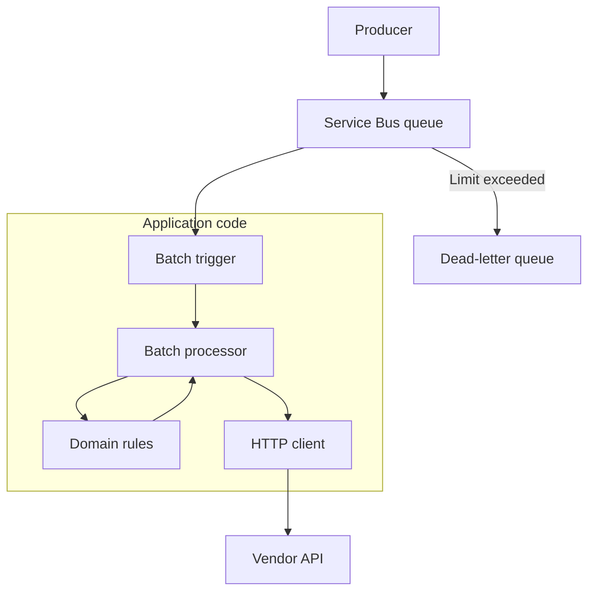
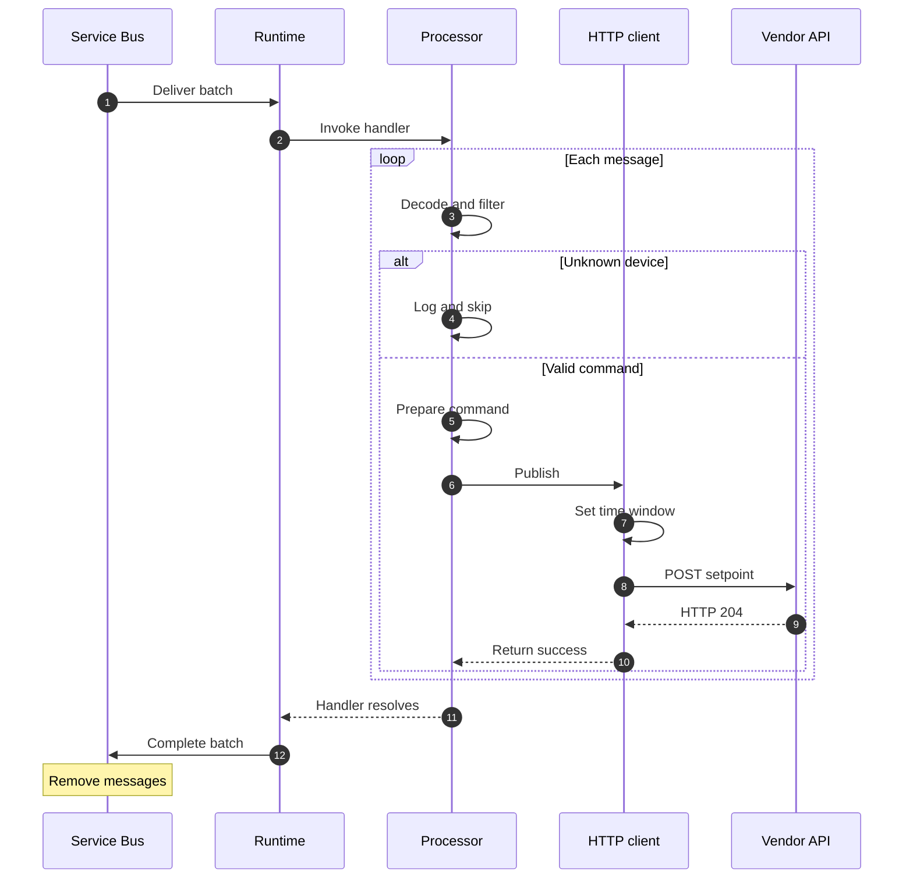
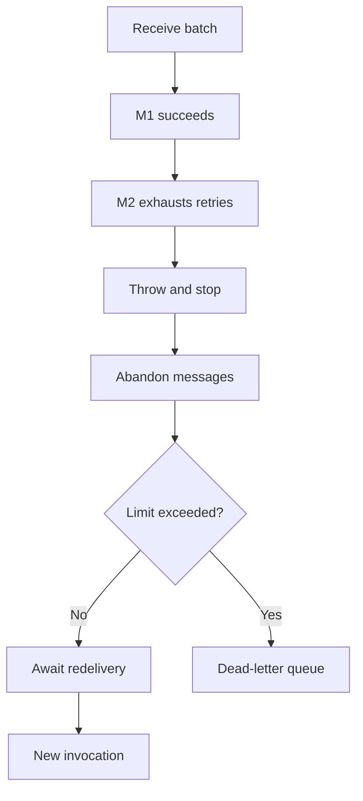
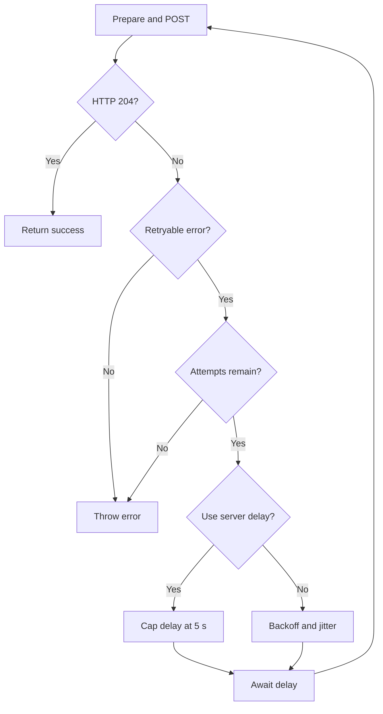

# Battered Batteries Setpoint Forwarder

A TypeScript Azure Functions v4 application that consumes batches of battery setpoints from Azure Service Bus, filters and converts them, and forwards accepted commands to the Battered Batteries API using Axios.

This is an assignment implementation, not a production-ready battery controller. The sections below separate implemented behavior, assumptions made from the supplied contract, and limitations that need further work.

## Contents

- [Architecture and processing](#architecture-and-processing)
- [Processing sequence](#processing-sequence)
- [Input and API mapping](#input-and-api-mapping)
- [Filtering and validation](#filtering-and-validation)
- [Service Bus sessions and ordering](#service-bus-sessions-and-ordering)
- [Message lifecycle and failure behavior](#message-lifecycle-and-failure-behavior)
- [HTTP reliability policy](#http-reliability-policy)
- [Assumptions and rationale](#assumptions-and-rationale)
- [Known trade-offs and limitations](#known-trade-offs-and-limitations)
- [Project structure](#project-structure)
- [Local development](#local-development)
- [Testing](#testing)
- [Deployment considerations](#deployment-considerations)
- [Optional appendix: Deployment and CI/CD](#appendix)

## Architecture and processing

The trigger registers the function and loads configuration. The batch processor controls filtering and sequencing; domain functions validate and transform the data; the HTTP client handles authentication, requests, and retries.



For each invocation:

1. `forwardBatterySetpoints` receives an array of message bodies and creates the API client.
2. `processSetpointBatch` decodes each body and checks its device ID.
3. Unsupported string device IDs are logged and skipped.
4. Accepted messages are validated and converted into a prepared setpoint.
5. The client creates a fresh API time window and posts the command.
6. The processor continues only after success. A final failure throws and stops the loop; later messages in that invocation are not attempted.
7. The Functions extension settles the delivered messages after the invocation.

`cardinality: "many"` enables batch input. The extension determines the actual batch size within its configuration; this project's `host.json` does not explicitly tune Service Bus batch settings. The application does not collect its own batches.

## Processing sequence

This diagram shows a successful invocation. The producer has already enqueued the messages with the appropriate session IDs. The batch processor includes decoding, filtering, and calls to the domain functions.



Validation errors and final HTTP failures exit this success path: the handler rejects, and the remaining messages are not processed. The diagrams below describe those failure paths.

## Input and API mapping

Example incoming body:

```json
{
  "device_id": "BB00001",
  "setpoint": {
    "value": 1,
    "unit": "kW",
    "endTime": "2025-01-01T10:01:00.000Z"
  },
  "eventTime": "2025-01-01T10:00:00.000Z"
}
```

| Input | Vendor destination | Implementation |
| --- | --- | --- |
| `device_id` | `/{device}/setpoint` | Accepted ID, URL-encoded |
| `setpoint.value` | `data.value` | `Math.round(value * -1000)` |
| `eventTime`, `setpoint.endTime` | Duration | `Math.ceil((endTimeMs - eventTimeMs) / 1000)` |
| Clock immediately before an attempt | `data.startTime` | `Math.floor(nowMs / 1000) + 2` |
| Start and duration | `data.endTime` | `startTime + durationSeconds` |

The input uses the grid perspective, whereas the API uses the battery perspective. Therefore, `+1 kW` becomes `-1000 W` for discharging, and `-2.5 kW` becomes `+2500 W` for charging.

The example has a 60-second duration. With the clock fixed at `2025-01-01T12:00:00.000Z`, it produces:

```json
{
  "data": {
    "startTime": 1735732802,
    "endTime": 1735732862,
    "value": -1000
  }
}
```

The time window is rebuilt before every HTTP attempt, not captured once at queue arrival. This avoids reusing timestamps made stale by an earlier retry delay, but does not guarantee that the start remains in the future when the vendor receives it.

## Filtering and validation

The accepted-device list is hardcoded:

```json
["BB00001", "BB00005", "BB00006", "BB00007", "BB00293"]
```

Filtering runs before full payload validation. A string device ID outside this list is skipped without an HTTP call, even if other fields are invalid. In the current processor, this also includes empty or whitespace-only string IDs. Missing or non-string IDs proceed to validation and fail.

For messages that reach validation, the code checks:

- the decoded body and `setpoint` are objects;
- `device_id` is a non-empty string;
- power is a finite number and the unit is exactly `kW`;
- timestamps are strings parseable by `Date.parse`;
- the original duration is between 60 and 3,600 seconds, inclusive.

Malformed JSON and validation failures throw. Date parsing is not strict ISO-format validation, and there is no device-specific power-limit check.

## Service Bus sessions and ordering

The assumed infrastructure contract is:

1. Queue `sbq-batbat-spt` has sessions enabled.
2. The producer sets Service Bus metadata `SessionId = device_id`.
3. Commands for each device are enqueued in their intended application order.

The trigger declares:

```typescript
isSessionsEnabled: true,
cardinality: "many",
autoCompleteMessages: true,
```

Service Bus gives one receiver exclusive ownership of a session while its lock is held. Sequential application processing preserves received order within an invocation. Different device sessions may run concurrently. See [Microsoft's session documentation](https://learn.microsoft.com/en-us/azure/service-bus-messaging/message-sessions).

The trigger flag does not provision the queue or assign session IDs. The application also does not verify that session metadata matches the body. It does not sort messages by `eventTime`.

Sessions order message handling; they do not guarantee the order in which an unreliable external API applies requests. For example, a timed-out HTTP request might still finish at the vendor after another attempt.

## Message lifecycle and failure behavior

With automatic settlement, a successful invocation causes the delivered messages to be completed. On failure, the runtime abandons uncompleted messages for redelivery; lock expiry or settlement failure can also cause redelivery. The application does not manually settle individual messages. See [Service Bus trigger behavior](https://learn.microsoft.com/en-us/azure/azure-functions/functions-bindings-service-bus-trigger#peeklock-behavior).

Consider a batch containing `M1`, `M2`, and `M3`:



In this example, the batch contains M1, M2, and M3. M1 receives HTTP 204; M2 fails after all HTTP attempts; M3 is not attempted because the handler stops. On redelivery, M1 may be posted again, and M2 and M3 may also return.

The broker applies its delivery-limit policy per message. The diagram is an example of one failed invocation, not a guarantee that all messages return together or have identical delivery counts.

The HTTP side effect cannot be rolled back when the queue invocation fails. Batch boundaries on redelivery need not match the previous invocation.

This is an **at-least-once processing design**, not an exactly-once guarantee. Repeated delivery failures can move messages to the dead-letter queue under the broker's `MaxDeliveryCount` policy. Successfully forwarded or unattempted messages can also accumulate delivery counts when abandoned together with a failed batch; the risk is not limited to the message that originally caused the failure.

Completing a message removes it from the active queue. It does not send a processing-complete notification to the producer.

## HTTP reliability policy

The client posts to `/{device}/setpoint` using `Ocp-Apim-Subscription-Key` authentication.



This is the current client policy, including the capped server delay described below. Throwing ends this HTTP retry loop; any later broker redelivery starts a separate invocation.

Diagram labels: **Prepare and POST** rebuilds the time window before each attempt. **Retryable error** means a timeout, network failure, HTTP 429, or HTTP 5xx. **Use server delay** means HTTP 429 with a valid `Retry-After` header; that delay is capped at five seconds. Otherwise the client uses exponential backoff and jitter. **Throw error** fails the invocation.

| Setting or outcome | Behavior |
| --- | --- |
| Timeout | 8 seconds per HTTP attempt |
| Attempt limit | Three total attempts per `publishSetpoint` call |
| HTTP 204 | Success |
| Network failure, timeout, HTTP 429 or 5xx | Retry while attempts remain |
| HTTP 400, 401, 404 | Throw without an internal HTTP retry |
| Other unexpected final response | Throw |
| Default retry delay | 500 ms, then 1,000 ms, plus 0–249 ms jitter |
| Valid `Retry-After` on 429 | Parse seconds or an HTTP date; cap the delay at 5 seconds |
| Missing or invalid `Retry-After` | Use exponential delay and jitter |

The five-second cap is an implementation limitation: `Retry-After: 60` causes a five-second wait, so the full server-requested cooldown is **not respected**. A production policy should honor that cooldown or defer work appropriately.

HTTP retries and broker redelivery are separate. A permanent HTTP error is not retried inside the client, but it still fails the invocation and can be attempted again after Service Bus redelivery. The three-attempt limit is not a lifetime limit per message.

## Assumptions and rationale

These are explicit interpretations of gaps or ambiguities in the assignment, not additional guarantees supplied by the API.

| Topic | Chosen assumption or decision | Rationale and consequence |
| --- | --- | --- |
| Duration | `endTime - eventTime` represents the intended command duration | Preserves the requested run length when delivery is delayed. The original absolute deadline is not retained. |
| Immediate activation | Send as soon as sequential processing permits, with a small future start offset | Reconciles the assignment's arrival-time wording with the Swagger's future-start requirement. Literal activation at arrival is not achieved. |
| Clock margin | Use `floor(now / 1000) + 2` | Provides just over one to two seconds of lead time. Assumes sufficiently aligned clocks and short request transit; this must be validated with the vendor. |
| Unknown devices | Interpret “abandon” as log and skip, not the formal broker operation | Avoids repeatedly retrying a permanently unsupported ID. If formal abandon is intended, this implementation does not meet that interpretation and needs a settlement change. |
| Ordering | Sessions enabled, one device per session, producer order is authoritative | Avoids concurrent consumers racing for the same device stream under normal lock ownership. Requires external setup. |
| Rounding | Round to whole watts; round duration upward to whole seconds | Matches the API's integer fields. May change power by up to half a watt and extend duration by less than one second. |
| Replacement | Each newly accepted setpoint replaces the previous one | Taken from the assignment's vendor explanation. Replacement avoids accumulating independent commands, but does not make replay harmless. |
| Cancellation | Do not generate clearing commands automatically | No cancellation action exists in the input schema; ordinary commands already replace older commands. |

### One-second clearing command

The vendor demonstration describes replacing a long command with a short one that expires after one second. A possible neutral request would use `value: 0` and `endTime = startTime + 1`.

Using zero is an assumption: it requests no charging or discharging during that second. After expiry, no active setpoint remains according to the demonstration. The contract does **not** specify whether the battery then stays neutral or resumes autonomous/default behavior.

This cancellation request is not implemented. Automatically sending it after a normal command would cancel that command. A future cancellation feature should have an explicit input action and bypass the normal one-minute minimum through a separate conversion path.

## Known trade-offs and limitations

- **Replay can change battery behavior.** Repeated commands get fresh timestamps, potentially extending their effect. Replaying earlier commands from a failed batch can temporarily replace a later command. Replacement semantics alone do not establish safe replay or a guaranteed final state.
- **Timeouts leave an uncertain outcome.** The vendor may have applied a request even when the client did not receive its response. Sequential awaits do not eliminate outstanding vendor-side processing after a timeout.
- **No exactly-once mechanism.** A local “processed messages” store could reduce duplicates but cannot, by itself, atomically coordinate an HTTP side effect with a database write. Stronger guarantees require a vendor-supported protocol such as idempotency plus an agreed ordering strategy.
- **No stale-command policy.** Delayed and redelivered commands retain their full duration. There is no age cutoff, original-deadline enforcement, or latest-command deduplication.
- **Batch failure affects healthy messages.** A poison message stops the remaining invocation and can cause other messages to replay or eventually dead-letter. Per-message settlement would reduce this coupling but adds complexity.
- **No global rate limiter or circuit breaker.** Sequential processing limits requests only within an invocation. Other sessions and instances can still load the API; broker redelivery does not provide a vendor-wide cooldown.
- **Batch and lock settings need tuning.** The repository uses extension defaults. Long batches combined with sequential timeouts and retries can exceed the available processing/lock budget.
- **Validation is intentionally limited.** There is no strict ISO timestamp enforcement, safe-integer check after conversion, or physical power-range validation. These need explicit contract limits and additional tests.
- **Live integration remains unverified.** Unit tests do not establish actual session delivery, settlement, vendor timing, or physical battery behavior.

## Project structure

| Path | Responsibility |
| --- | --- |
| `src/index.ts` | Imports the function registration |
| `src/config.ts` | Queue constants and environment configuration |
| `src/domain/setpoint.ts` | Message types, validation, and conversion |
| `src/functions/forwardBatterySetpoints.ts` | Trigger registration and client construction |
| `src/services/processSetpointBatch.ts` | Filtering and sequential orchestration |
| `src/services/batteredBatteriesClient.ts` | Axios requests, timeout, and retries |
| `test/setpointConversion.test.ts` | Unit tests |
| `host.json` | Functions host and extension bundle settings |
| `local.settings.example.json` | Configuration template without credentials |
| `package.json`, `package-lock.json` | Scripts and dependency versions |
| `tsconfig.json` | Compiler settings; output goes to `dist/` |

The v4 programming model registers the trigger with `app.serviceBusQueue(...)`, rather than a hand-written `function.json`. See the [Node.js developer guide](https://learn.microsoft.com/en-us/azure/azure-functions/functions-reference-node).

## Local development

### Install and verify

The package declares Node.js 22–24. Use a Node version supported by the target Azure hosting environment as well.

```bash
npm ci
npm run check
```

`npm ci` installs the locked dependency versions. `npm install` can also be used during development. The check command compiles application TypeScript and runs Vitest; `tsconfig.json` excludes the test directory, so this command does not separately type-check test files.

| Command | Purpose |
| --- | --- |
| `npm run build` | Clean `dist/` and compile application code |
| `npm run watch` | Recompile on source changes |
| `npm test` | Run Vitest once |
| `npm run test:watch` | Run Vitest in watch mode |
| `npm run check` | Build and run tests |
| `npm start` | Build and start the Functions host |

### Local configuration

```powershell
Copy-Item local.settings.example.json local.settings.json
```

Configure:

- `CONNECTION-STRING-SBQ-BATBAT-SPT`: queue connection string;
- `BATTERED_BATTERIES_API_KEY`: vendor API key;
- `BATTERED_BATTERIES_BASE_URL`: optional, defaults to `https://BatB.azure-api.net`;
- `AzureWebJobsStorage`: the example uses `UseDevelopmentStorage=true`, which requires a running Azurite emulator when storage is accessed, or a suitable real storage connection.

Azure Functions Core Tools v4 is needed for local host execution and is included as a development dependency. The trigger's `connection` field refers to a setting name, not a secret value. Never commit `local.settings.json` or real API credentials.

There is no vendor test environment. Do not start the integration with real credentials without authorization to consume the queue and call the vendor API.

## Testing

The expanded test file defines **17 test cases**, including parameterized cases. It covers selected examples of:

- sign/unit conversion and shifted API timestamps;
- duration rejection, malformed JSON, and unsupported units;
- unknown-device filtering;
- mocked 429, timeout, and 500 retries;
- no internal retries for 400, 401, and 404;
- rejection of an unexpected HTTP 200;
- sequential batch calls and propagation of a client failure;
- forwarding an accepted single-message batch through `processSetpointBatch`.

HTTP clients, delays, and logging contexts are mocked where needed; these tests do not contact Azure or the vendor API. The last test calls the batch processor, not the registered Azure trigger, so it does not verify the trigger handler contract or session configuration. The ordering test verifies loop sequencing, not live Service Bus session ordering.

**Assignment compliance:** the supplied task requests one implemented test and descriptive TODO comments for all others. The expanded 17-case suite exceeds that requirement. Unless the examiner approves the expansion, retain one implemented test in the submission and express the remaining scenarios as TODO comments; update this section to match that submitted version.

## Deployment considerations

Before running against real resources:

1. Provision the Function App, storage, session-enabled queue, and required settings separately; this repository contains no infrastructure deployment code.
2. Confirm the producer's session ID and command-ordering contract.
3. Select a conservative batch size and verify processing time against queue/session locks and Function timeout settings. Do not assume single-message lock-renewal settings apply unchanged to batches.
4. Agree unknown-device handling, stale-command behavior, and cancellation semantics with the examiner or service owner.
5. Fix the truncated `Retry-After` handling and agree vendor-wide concurrency/cooldown limits before relying on this for production.
6. Add dead-letter monitoring and controlled replay procedures. Replaying old commands must account for their age and possible HTTP side effects.
7. Verify the selected runtime/extension combination with an authorized session-enabled integration test and an isolated HTTP stub before vendor testing.

The [Service Bus binding configuration reference](https://learn.microsoft.com/en-us/azure/azure-functions/functions-bindings-service-bus#hostjson-settings) describes the host settings to review during deployment.

## Appendix (Optional: Deployment and CI/CD)

Detailed deployment and CI/CD material is kept separately from the main assignment documentation:

- [Deployment and CI/CD](appendix/deployment-and-cicd.md)
