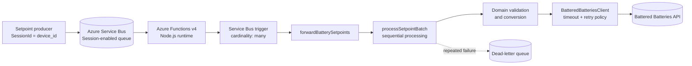
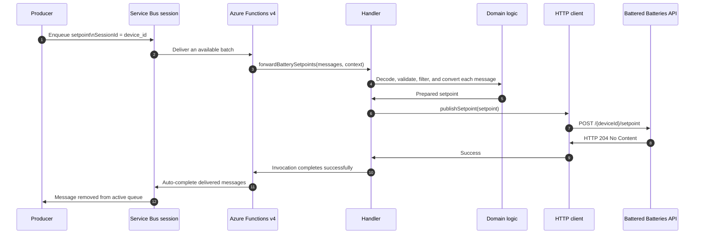
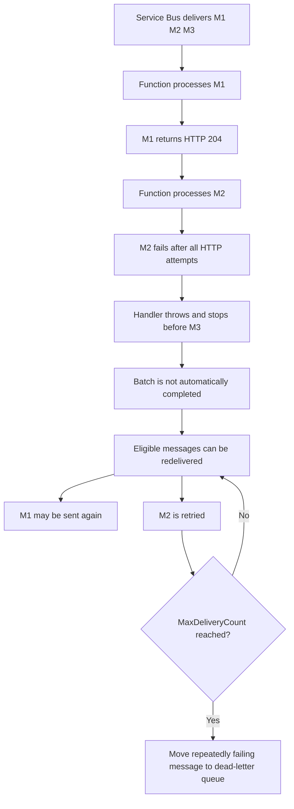
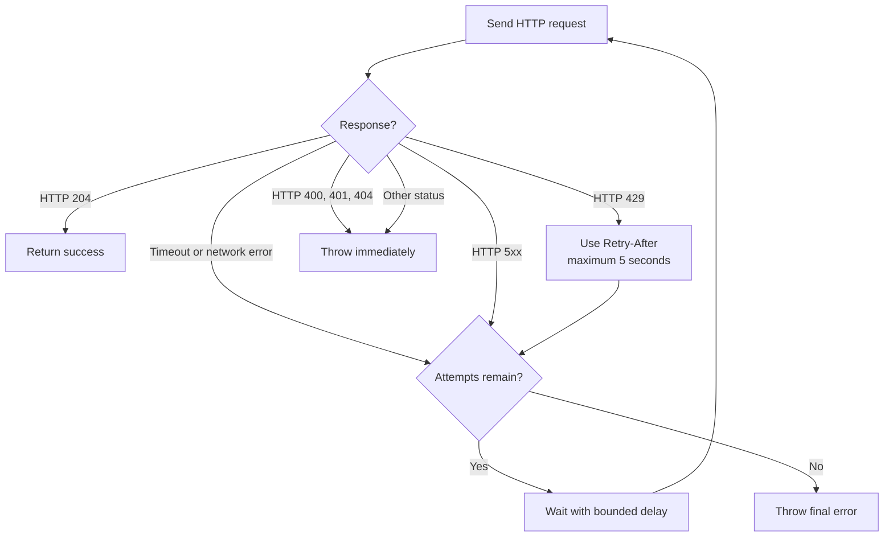

# Battered Batteries Setpoint Forwarder

> Assignment project: a TypeScript Azure Functions v4 service that consumes battery setpoints from Azure Service Bus, validates and transforms them, and forwards them to the Battered Batteries API.

## Overview

This project demonstrates a small, production-minded integration service built around an event-driven workflow:

- Azure Service Bus provides durable message delivery.
- Azure Functions v4 provides the serverless execution runtime.
- TypeScript provides compile-time checking and maintainable application code.
- Axios handles outbound HTTP communication.
- Vitest verifies conversion, validation, retry, ordering, and failure behavior.

The implementation keeps the trigger, domain rules, batch orchestration, and HTTP reliability policy separate. This makes the solution easier to review, test, and evolve.

## Architecture



## End-to-end processing



The trigger receives an array because `cardinality` is set to `"many"`. The Service Bus extension chooses the actual batch composition using the available messages and its configured runtime behavior; the application does not choose the batch size.

Within one invocation, `processSetpointBatch` uses `await` inside a `for...of` loop. The next message is not sent until the current message has completed successfully or failed.

## Message lifecycle and failure behavior



The trigger uses automatic settlement:

- Successful invocation: delivered messages are completed and removed.
- Failed invocation: automatic completion does not occur; messages can be delivered again.
- Repeated failure: Service Bus moves a message to the dead-letter queue according to the queue's `MaxDeliveryCount` setting.

This is **at-least-once delivery**, not exactly-once delivery. A message that already caused an HTTP side effect can be replayed if the overall invocation later fails. The vendor endpoint replaces the current setpoint, which makes replay reasonably safe, but the implementation does not provide strict idempotency.

## Service Bus sessions and ordering

The implementation assumes the following infrastructure contract:

1. Queue `sbq-batbat-spt` is session-enabled.
2. The producer sets `SessionId` to the message's `device_id`.
3. Messages for each device are enqueued in the intended order.

The trigger declares:

```typescript
isSessionsEnabled: true
```

Sessions give one receiver an exclusive lock for a device session. Different device sessions may still run concurrently, while messages within one session remain ordered. The sequential loop preserves that order inside the received batch as well.

Setting `isSessionsEnabled` in code does not create or configure the Azure queue, and it does not assign `SessionId`. Those responsibilities belong to the Azure resource and the producing application.

## Input and API mapping

Example input:

```json
{
  "device_id": "BB00001",
  "setpoint": {
    "value": 1,
    "unit": "kW",
    "endTime": "2025-01-01T10:01:00.000Z"
  },
  "eventTime": "2025-01-01T10:00:00.000Z"
}
```

The conversion rules are:

| Incoming value | Vendor value | Rule |
| --- | --- | --- |
| `device_id` | URL `/{device}/setpoint` | Device must be accepted |
| `setpoint.value` in kW | `data.value` in W | Multiply by `-1000` and round |
| `eventTime` and `setpoint.endTime` | Duration | `endTime - eventTime` |
| Processing time | `data.startTime` | Current epoch seconds plus 2 seconds |
| Original duration | `data.endTime` | New start time plus duration |

For the example above:

```text
+1 kW -> -1000 W
10:01 - 10:00 -> 60 seconds
```

The resulting request has this shape:

```json
{
  "data": {
    "startTime": 1735732802,
    "endTime": 1735732862,
    "value": -1000
  }
}
```

The API requires a future `startTime`, so the request window is rebuilt immediately before every HTTP attempt. This prevents a retry delay from making the original start time invalid.

## Validation rules

The domain layer rejects messages when:

- the payload is not a JSON object;
- `device_id` is missing or empty;
- the device is not in the accepted-device list;
- `setpoint` is not an object;
- `setpoint.value` is not a finite number;
- `setpoint.unit` is not `kW`;
- `eventTime` or `endTime` is not a valid date;
- the duration is shorter than one minute or longer than one hour.

Unknown device IDs are logged and skipped by the batch processor. Other validation failures throw, causing the invocation to fail so Service Bus can retry the delivery.

## HTTP reliability policy



The client uses:

- 8-second timeout per HTTP attempt;
- at most three total attempts;
- exponential retry delay starting at 500 ms;
- up to 250 ms of random jitter on exponential delays;
- `Retry-After` for HTTP 429, capped at 5 seconds;
- retries for network failures, timeouts, HTTP 429, and HTTP 5xx;
- no internal retry for HTTP 400, 401, or 404;
- HTTP 204 as the only successful vendor response.

HTTP retries are separate from Service Bus redelivery. If all HTTP attempts fail, the handler throws and the broker may deliver the message again according to its delivery policy.

## Project structure

```text
battered-batteries-function/
├── src/
│   ├── index.ts                              Application entry point
│   ├── config.ts                             Queue and environment configuration
│   ├── domain/setpoint.ts                    Validation and data conversion
│   ├── functions/forwardBatterySetpoints.ts Service Bus trigger registration
│   └── services/
│       ├── batteredBatteriesClient.ts        Axios client and retry policy
│       └── processSetpointBatch.ts           Filtering and ordered processing
├── test/
│   └── setpointConversion.test.ts            Vitest unit tests
├── host.json                                 Azure Functions host settings
├── local.settings.example.json               Local configuration template
├── package.json                              Scripts and dependencies
├── tsconfig.json                             TypeScript compiler settings
└── README.md                                 Project documentation
```

Azure Functions v4 registers the trigger in TypeScript with `app.serviceBusQueue(...)`; this project intentionally does not use a hand-written `function.json` file.

## Local development

### Prerequisites

- Node.js 22 or 24
- npm
- Azure Functions Core Tools v4 for local host execution
- Access to the required Service Bus queue and vendor API if running the live integration

### Install and verify

```bash
npm install
npm run check
```

The `check` script compiles TypeScript and then runs the Vitest suite.

### Available commands

| Command | Purpose |
| --- | --- |
| `npm run build` | Remove `dist/` and compile TypeScript |
| `npm run watch` | Recompile automatically when TypeScript files change |
| `npm test` | Run the Vitest suite once |
| `npm run test:watch` | Keep Vitest running and rerun changed tests |
| `npm run check` | Build the project and run all tests |
| `npm start` | Build and start Azure Functions Core Tools locally |

### Local configuration

Copy the example settings file:

```powershell
Copy-Item local.settings.example.json local.settings.json
```

Set the required values in `local.settings.json`:

- `CONNECTION-STRING-SBQ-BATBAT-SPT`: the Service Bus connection string;
- `BATTERED_BATTERIES_API_KEY`: the vendor API key;
- `BATTERED_BATTERIES_BASE_URL`: optional API base URL.

The trigger's `connection` property contains the application setting name, not the connection-string value. `local.settings.json` is ignored by Git and must never be committed.

## Testing

The current suite contains 17 unit tests covering:

- positive and negative power conversion;
- duration and payload validation;
- malformed JSON and unsupported units;
- unknown-device filtering;
- HTTP 429, timeout, and HTTP 5xx retries;
- non-retryable HTTP 400, 401, and 404 responses;
- HTTP 204 success handling;
- sequential message ordering;
- failed invocation behavior.

Run the suite with:

```bash
npm test
```

The tests use mocked HTTP clients and fake contexts. They do not contact Azure or the vendor API. A live session-enabled Service Bus integration test requires deployed Azure resources and is intentionally outside the safe local test suite.

## Deployment and operational considerations

The following resources are external to this repository and must be configured during deployment:

- an Azure Function App using the Node.js runtime;
- a session-enabled Service Bus queue named `sbq-batbat-spt`;
- a Service Bus connection-string application setting;
- the vendor API key and base URL application settings;
- a producer that sets `SessionId` to `device_id`.

Before production use, confirm:

- the queue's `MaxDeliveryCount` and lock duration;
- dead-letter monitoring and replay procedures;
- the intended behavior for unknown devices;
- vendor rate limits across multiple sessions and Function instances;
- whether idempotency or durable deduplication is required.

There is no vendor test environment for this assignment. Do not run `npm start` with real credentials unless you are authorized to consume the real queue and call the real API.

## Known trade-offs

- Automatic batch settlement can replay messages that already caused an HTTP side effect.
- A poison message can block later commands in the same ordered device session until it succeeds or is dead-lettered.
- Sequential processing limits concurrency within one invocation, but it is not a global vendor rate limiter.
- The vendor contract provides no idempotency key, status lookup, or safe test endpoint.
- A one-second neutral setpoint can represent cancellation, but the current input contract has no explicit cancellation action, so it is not generated automatically.

## References

- [Azure Functions Service Bus trigger](https://learn.microsoft.com/azure/azure-functions/functions-bindings-service-bus-trigger)
- [Azure Service Bus message sessions](https://learn.microsoft.com/azure/service-bus-messaging/message-sessions)
- [Azure Functions Node.js developer guide](https://learn.microsoft.com/azure/azure-functions/functions-reference-node)
