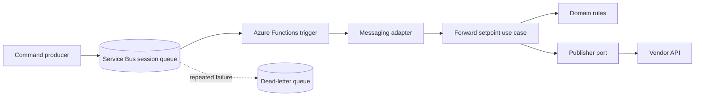
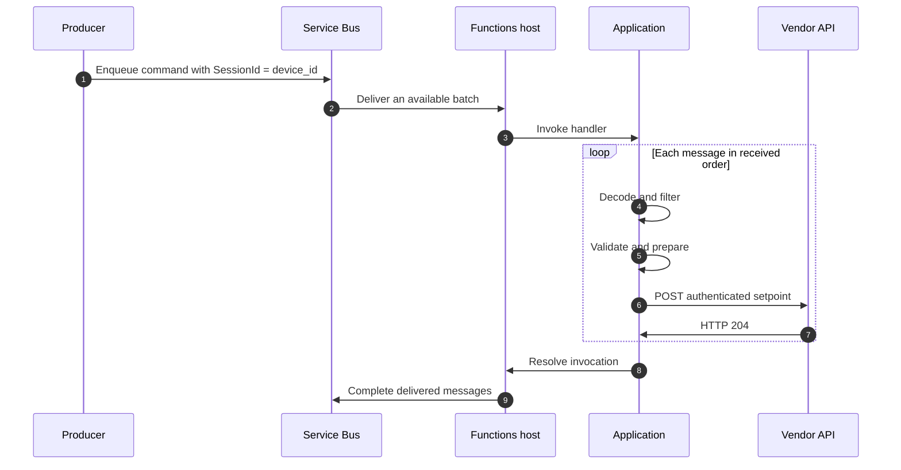
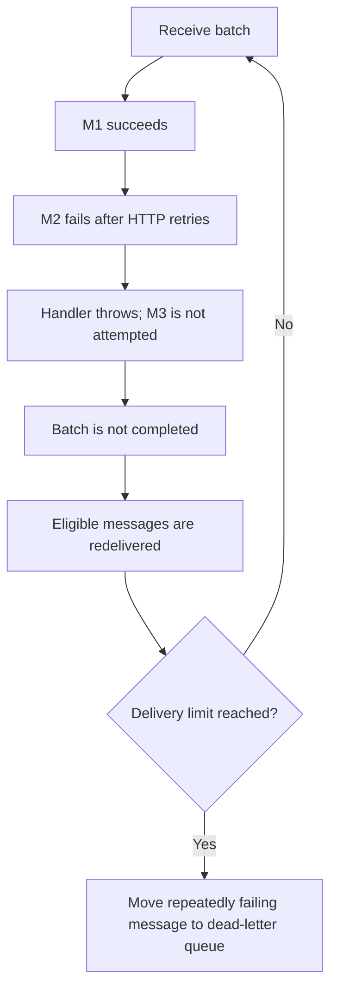

# Battered Batteries Setpoint Forwarder

> Assignment solution: an Azure Functions v4 service that receives battery setpoints from Azure Service Bus, validates and converts them, and forwards accepted commands to the Battered Batteries API.

## Contents

- [Overview](#overview)
- [Architecture](#architecture)
- [Development](#development)
- [Testing](#testing)
- [Deployment](#deployment)
- [Operations](#operations)
- [Assumptions and limitations](#assumptions-and-limitations)
- [Repository layout](#repository-layout)

## Overview

This is a small event-driven integration service. It does not own battery inventory, scheduling, billing, or physical battery execution. Its responsibility is to translate a producer command into the vendor's command format and deliver it reliably.

The service uses:

- **Azure Service Bus** for durable, session-aware message delivery.
- **Azure Functions v4** for serverless execution.
- **TypeScript** for maintainable application code and compile-time checks.
- **Axios** for authenticated vendor HTTP calls.
- **Terraform** for repeatable Azure infrastructure.
- **Azure DevOps pipelines** for validation, infrastructure changes, and artifact release.

## Architecture



The source is organized using a lightweight DDD and ports-and-adapters structure:

```text
interfaces -> infrastructure/bootstrap -> application -> domain
```

- **Domain** contains accepted-device rules, duration validation, power conversion, and immutable prepared values.
- **Application** coordinates one command through the `SetpointPublisher` port.
- **Infrastructure** maps Service Bus messages, creates vendor requests, and handles HTTP retries.
- **Interfaces** register the Azure Functions trigger.
- **Bootstrap** loads configuration and creates shared dependencies.

The domain and application layers do not depend on Azure Functions, Axios, or environment variables.

### Message flow



The trigger uses `cardinality: "many"`; Azure chooses the actual batch composition. The host configuration limits a batch to five messages. The processor awaits each message before starting the next one, so processing is sequential within an invocation.

### Input and conversion

Example input:

```json
{
  "device_id": "BB00001",
  "setpoint": {
    "value": 1,
    "unit": "kW",
    "endTime": "2025-01-01T10:01:00.000Z"
  },
  "eventTime": "2025-01-01T10:00:00.000Z"
}
```

| Input | Vendor request | Rule |
| --- | --- | --- |
| `device_id` | `/{device}/setpoint` | Must be in the accepted-device list |
| `setpoint.value` in kW | `data.value` in W | Multiply by `-1000` and round |
| `eventTime` and `endTime` | Command duration | Between one minute and one hour |
| Processing time | `data.startTime` | Current epoch time plus two seconds |
| Duration | `data.endTime` | New start time plus the original duration |

The sign changes because the producer uses the grid perspective and the vendor uses the battery perspective. For example, `+1 kW` becomes `-1000 W`, while `-2.5 kW` becomes `+2500 W`.

The API request window is rebuilt immediately before each HTTP attempt so that a retry still receives a future start time.

## Development

### Prerequisites

- Node.js 24 is preferred; Node.js 22 is also supported.
- npm.
- Azure Functions Core Tools v4 for running the local host.
- A development Service Bus queue if testing the live trigger locally.
- Azurite only when local Functions storage is required.

### Install and verify

```bash
npm ci
npm run check
```

The check command builds the application, type-checks the test project, and runs the complete safe test suite.

### Local vendor fixture

The repository includes a loopback vendor fixture. Start it in one terminal:

```bash
npm run dev:vendor
```

It listens on `http://127.0.0.1:7072`, checks the local API key, accepts the expected setpoint route, and returns HTTP 204. It never contacts the real vendor.

### Local Functions host

1. Copy `local.settings.example.json` to `local.settings.json`.
2. Configure development Service Bus access and the vendor API key.
3. Point `BATTERED_BATTERIES_BASE_URL` at the local fixture when appropriate.
4. Use a session-enabled development queue with `SessionId = device_id`.
5. Start the fixture and Functions host in separate terminals.
6. Send only approved development messages.

```bash
npm start
```

Do not point a local host at a production queue or vendor endpoint without explicit authorization.

### Useful commands

| Command | Purpose |
| --- | --- |
| `npm run build` | Clean and compile application code |
| `npm run watch` | Recompile when source files change |
| `npm test` | Run all tests once |
| `npm run test:watch` | Run tests continuously |
| `npm run check` | Build, type-check tests, and run tests |
| `npm run package` | Create the deployable application package |
| `npm start` | Build and start the local Functions host |

`local.settings.json`, credentials, Terraform state, and generated packages must not be committed.

## Testing

### Test layers

| Layer | Location | Purpose |
| --- | --- | --- |
| Unit | `tests/unit/domain` | Domain rules and conversion |
| Unit | `tests/unit/application` | Use-case behavior with fake ports |
| Unit | `tests/unit/infrastructure` | Mapping, filtering, retries, and ordering |
| Integration | `tests/integration` | Vendor HTTP adapter against local fixtures |
| Architecture | `tests/architecture` | Enforce dependency direction |
| Release gate | `tests/integration/releaseGate.test.ts` | Verify release prerequisites and trigger registration |

### Safe checks

```bash
npm run check
npm run test:unit
npm run test:integration
npm run test:architecture
npm run typecheck:tests
```

The tests use mocks or local fixtures and do not contact Azure Service Bus or the real vendor API. `npm run test:ci` additionally produces a JUnit report for pipeline publishing.

### Cloud acceptance

Live Azure acceptance is a separate activity using approved development resources. It should verify valid forwarding, per-device ordering, independent sessions, unknown-device handling, dead-letter behavior, retry recovery, worker restart recovery, and missing-role diagnostics.

The repository provides the local fixture and test boundaries; it does not automatically send commands to a real battery.

## Deployment

Deployment is intentionally kept outside the main assignment explanation. The repository includes Terraform and Azure DevOps pipeline definitions for a separate, reviewable deployment path.

See the [Deployment and CI/CD appendix](appendix/deployment-and-cicd.md) for infrastructure ownership, Terraform workflow, pipeline flow, identity, secrets, promotion, rollback, and environment caveats.

## Operations

### Delivery and failure behavior

The service uses automatic settlement and at-least-once delivery:

- Successful invocation: delivered messages are completed.
- Failed invocation: messages can be delivered again.
- Repeated failures: Service Bus moves messages to the dead-letter queue according to `MaxDeliveryCount`.

A failed message stops the current loop. Messages already sent successfully may be replayed, and later messages in the batch are not attempted during that invocation.



### Monitoring

Monitor failed invocations, dead-letter count, queue age, delivery count, vendor latency, throttling, session locks, and worker restarts. Logs should identify the device and invocation without exposing secrets.

### Dead-letter handling

Do not bulk replay dead letters. Review the reason, age, device, delivery history, and current validity first. Replaying an old message creates a new time window and can change its position relative to newer commands. Record the original message ID, reason, operator, time, and replacement message ID.

### HTTP reliability

The vendor client uses an 8-second timeout per attempt and at most three attempts. It retries network failures, timeouts, HTTP 429, and HTTP 5xx responses. HTTP 400, 401, and 404 are not retried inside the client. Only HTTP 204 is accepted as success. Retry delays use exponential backoff with jitter, while a valid `Retry-After` value for HTTP 429 is capped at five seconds.

## Assumptions and limitations

These decisions come from gaps or ambiguities in the supplied assignment contract and should be confirmed before production use:

| Area | Decision | Consequence |
| --- | --- | --- |
| Queue ordering | Session-enabled queue with `SessionId = device_id` | Ordering depends on the producer and broker setup |
| Unknown devices | Log and skip unsupported string IDs | They do not enter the vendor flow or retry loop |
| Duration | Use `endTime - eventTime` | Delivery delay does not shorten the requested duration |
| Activation | Add a small future clock margin | Literal activation at queue arrival is not guaranteed |
| Replacement | A new setpoint replaces the current command | Replay is tolerable but not strictly idempotent |
| Cancellation | No explicit cancellation action exists | No one-second clearing command is generated automatically |
| Infrastructure | Terraform is a starting Azure design | Quotas, networking, approvals, and availability need review |

Known limitations include uncertain outcomes after HTTP timeouts, no vendor idempotency key, no global rate limiter, fixed device allowlist, no stale-command policy, and possible replay of healthy messages in a failed batch.

## Repository layout

| Path | Responsibility |
| --- | --- |
| `src/domain` | Battery rules and immutable values |
| `src/application` | Use cases and ports |
| `src/infrastructure` | Messaging and HTTP adapters |
| `src/interfaces` | Azure Functions trigger registration |
| `src/bootstrap` | Configuration and dependency wiring |
| `tests` | Unit, integration, architecture, and release-gate tests |
| `appendix/deployment/infra` | Terraform infrastructure |
| `appendix/deployment/pipelines` | Azure DevOps pipeline definitions |
| `appendix/deployment/scripts` | Deployment and release helpers |
| `README.md` | Single project and operational document |

## References

- [Azure Functions Service Bus trigger](https://learn.microsoft.com/en-us/azure/azure-functions/functions-bindings-service-bus-trigger)
- [Azure Service Bus message sessions](https://learn.microsoft.com/en-us/azure/service-bus-messaging/message-sessions)
- [Azure Functions Node.js developer guide](https://learn.microsoft.com/en-us/azure/azure-functions/functions-reference-node)
- [Azure Functions Flex Consumption](https://learn.microsoft.com/en-us/azure/azure-functions/flex-consumption-plan)
- [Azure Functions deployment technologies](https://learn.microsoft.com/en-us/azure/azure-functions/functions-deployment-technologies)
