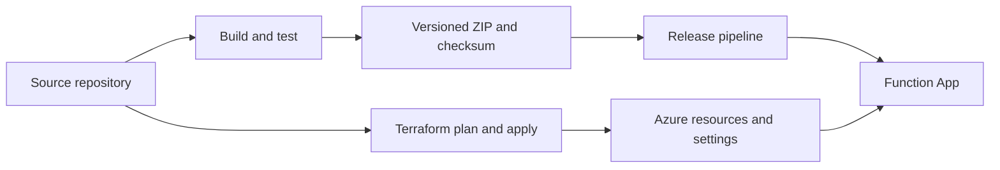

# Appendix: Deployment and CI/CD

This appendix contains the infrastructure and delivery reference for the assignment. The main [README](../README.md) intentionally keeps deployment details brief so it can focus on the application design and behavior.

## Ownership model



- **Terraform** owns Azure resources, identities, permissions, settings, monitoring, and trigger state.
- **CI** builds, tests, packages, and records the artifact checksum.
- **Release** deploys the same verified artifact through development and production approvals.

The trigger is disabled by default. Enable it only after the endpoint, secret, producer session contract, and development acceptance evidence are confirmed.

## Azure resources

`appendix/deployment/infra/terraform` provisions the starting environment design:

- Linux Flex Consumption Function App using Node.js 24;
- session-enabled Standard Service Bus queue;
- managed storage for the Functions host and deployment package;
- Key Vault for the vendor secret reference;
- managed identity and least-privilege role assignments;
- Application Insights, Log Analytics, and alerts.

Dev and prod use separate names and Terraform state. Confirm quotas, networking, naming, retention, and company landing-zone requirements before production use.

## Terraform workflow

Terraform 1.13.x and Azure CLI are required. Validate without contacting Azure:

```bash
terraform fmt -check -recursive appendix/deployment/infra
terraform -chdir=appendix/deployment/infra/terraform init -backend=false -input=false -lockfile=readonly
terraform -chdir=appendix/deployment/infra/terraform validate
```

Configure an environment with the provided examples:

```powershell
Copy-Item appendix/deployment/infra/terraform/environments/dev.tfvars.example appendix/deployment/infra/terraform/environments/dev.tfvars
Copy-Item appendix/deployment/infra/terraform/environments/dev.backend.hcl.example appendix/deployment/infra/terraform/environments/dev.backend.hcl
```

Then review and apply a saved plan:

```bash
az login
terraform -chdir=appendix/deployment/infra/terraform init -reconfigure -backend-config=environments/dev.backend.hcl
terraform -chdir=appendix/deployment/infra/terraform plan -var-file=environments/dev.tfvars -out=dev.tfplan
terraform -chdir=appendix/deployment/infra/terraform show dev.tfplan
terraform -chdir=appendix/deployment/infra/terraform apply dev.tfplan
terraform -chdir=appendix/deployment/infra/terraform output
```

Use separate production inputs and state. Never put secret values in `.tfvars` or Terraform state. The vendor secret is supplied to Key Vault outside Terraform.

`appendix/deployment/infra/bootstrap` is an optional one-time example for creating a remote state storage account when a company backend does not already exist. Its initial local state must be protected and migrated into the company-managed backend.

## Pipeline flow

The pipeline definitions are in `appendix/deployment/azure-pipelines.yml` and `appendix/deployment/pipelines/`.

1. CI validates and packages the application.
2. Infrastructure is planned and applied with approval.
3. The same artifact is deployed to development.
4. Development acceptance evidence is reviewed.
5. Production deployment requires the configured environment approval.

```mermaid
flowchart LR
    Commit[Commit or pull request] --> CI[CI validation]
    CI --> Package[Build and package artifact]
    Package --> Infra[Approved Terraform apply]
    Infra --> Dev[Development deployment]
    Dev --> Acceptance[Acceptance evidence]
    Acceptance --> Approval[Production approval]
    Approval --> Prod[Production deployment]
```



The release should verify the artifact checksum and commit identity before deploying. Promotion should use the same built artifact rather than rebuilding it in each environment.

## Release and rollback

Keep infrastructure changes and application releases separate. Application rollback is performed by redeploying a retained successful artifact through the normal release path. An application rollback cannot undo a vendor command that was already accepted.

If queue consumption must be paused, disable the trigger through the controlled configuration, assess active vendor effects, then redeploy or re-enable only after registration and configuration have been verified.

## Identity and secrets

The Function uses managed identity for Azure resources and a Key Vault reference for the vendor API key. Secret values must be supplied outside Terraform and must not appear in `.tfvars`, pipeline variables committed to source, logs, or Terraform state.

The Function identity requires only the roles needed for:

- receiving from the Service Bus queue;
- reading Function host and deployment storage;
- reading the vendor secret from Key Vault.

Producer and deployment identities should use separate permissions.

## Infrastructure caveats

This Terraform configuration is a reviewed starting point, not a complete enterprise landing zone. Confirm the following before production:

- Azure region and Flex Consumption availability;
- subscription quota and naming availability;
- private networking and approved egress;
- storage redundancy and retention;
- environment approvals and identity federation;
- alert ownership and operational response;
- queue lock, batch, and delivery settings under realistic load.
