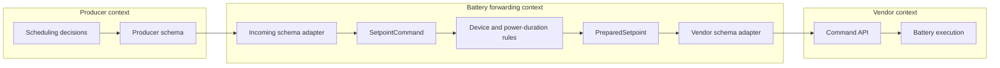
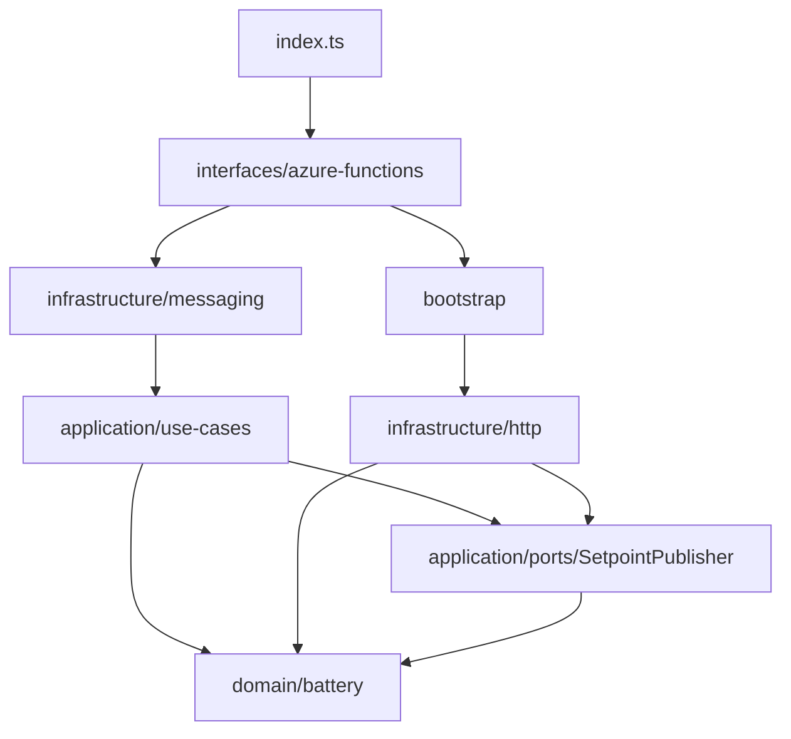
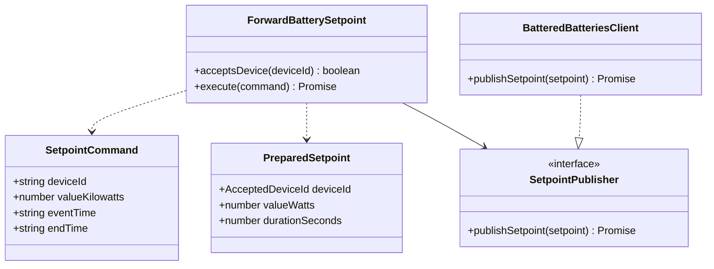
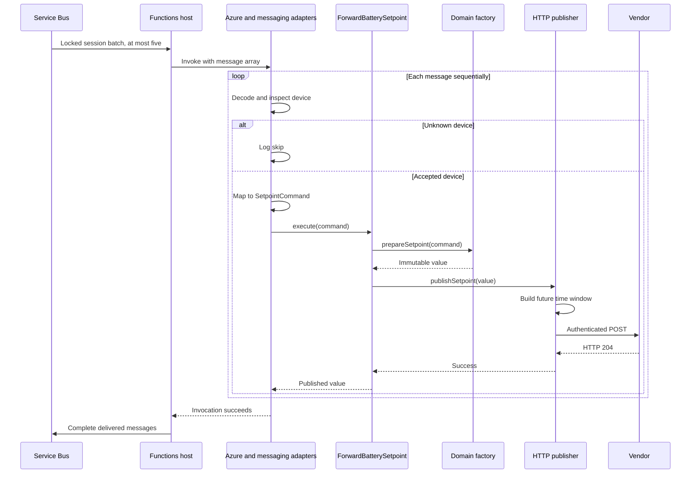
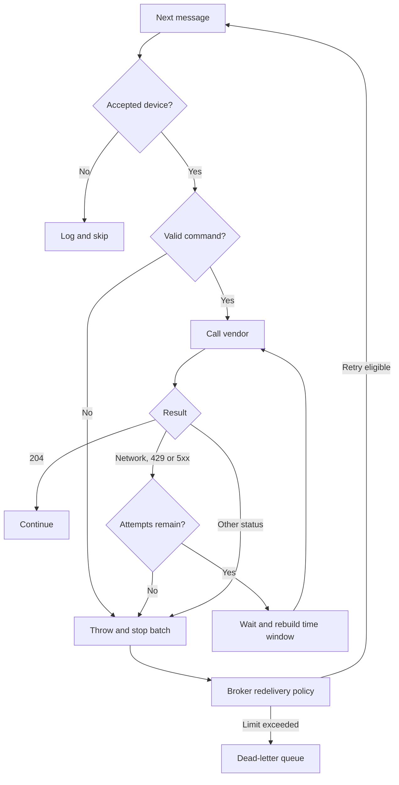
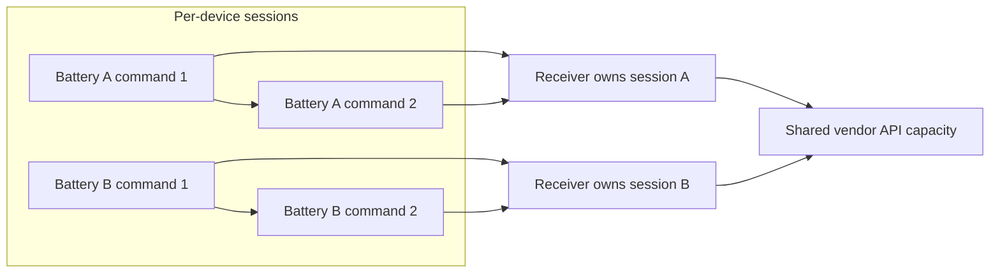

# Source architecture

## Bounded context

The context is **battery setpoint forwarding**: translating a producer's grid command into a vendor battery command. It does not own inventory, scheduling, billing or physical battery execution.

| Domain term | Meaning |
| --- | --- |
| SetpointCommand | Device, grid power and original time interval |
| AcceptedDeviceId | A device in the assignment allowlist |
| PreparedSetpoint | Immutable battery watts and duration, produced by a validating factory |
| SetpointPublisher | Capability to deliver a prepared setpoint |

The schema adapters isolate snake_case producer fields and vendor JSON wrappers from the domain. This is pragmatic DDD with ports and adapters. There is no persisted aggregate or repository because the service currently has no local business state. If durable deduplication or latest-command state becomes a requirement, model that state explicitly and introduce a persistence port.

## Dependency direction

Arrows below indicate source dependencies. The architecture test enforces allowed import directions. Runtime calls can flow through a port into its concrete implementation.

| Layer | Responsibility | Dependencies it must avoid |
| --- | --- | --- |
| Domain | Device eligibility, duration, power conversion, immutable values | Azure, Axios, environment variables, transport parsing |
| Application | Validate and publish one command through a port | Azure and concrete adapters |
| Infrastructure | Wire decoding, vendor mapping, HTTP and retries | Bootstrap and trigger registration |
| Interfaces | Register trigger and bridge the invocation | Business calculations |
| Bootstrap | Read settings and construct dependencies | Business decisions |

## Composition and execution

`bootstrap/container.ts` lazily creates one HTTP client per worker process. This is not a global distributed singleton: multiple Azure instances have independent clients. Tests construct the use case with fake ports or a publisher pointing at the loopback server.

## Failures and ordering

Sessions coordinate receiver ownership, and the sequential loop preserves received order. Neither gives exactly-once HTTP side effects or a global vendor rate limit. Manually replaying dead letters also changes their broker ordering. Cloud acceptance tests must verify actual host/session recovery.

## Decisions retained and future extensions

- Retain the batch trigger contract, now capped at five. Single-message invocation is a possible later change that reduces replay scope.
- Keep the allowlist in the domain until an actual inventory service becomes authoritative.
- Preserve rebuilding the time interval from processing time. Expiry and latest-command-wins require a business decision.
- Do not add a deduplication database without defining the crash window after HTTP success and before broker completion. Vendor idempotency or reconciliation is needed to resolve ambiguous outcomes.

References: [Service Bus sessions](https://learn.microsoft.com/en-us/azure/service-bus-messaging/message-sessions), [Functions Service Bus binding](https://learn.microsoft.com/en-us/azure/azure-functions/functions-bindings-service-bus).
