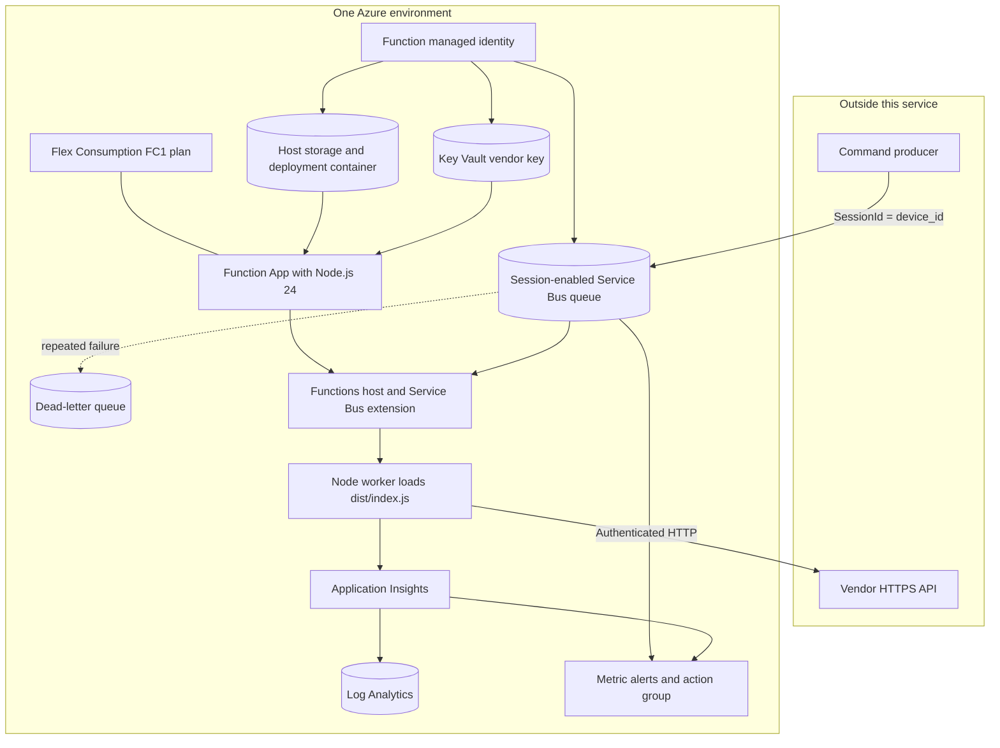
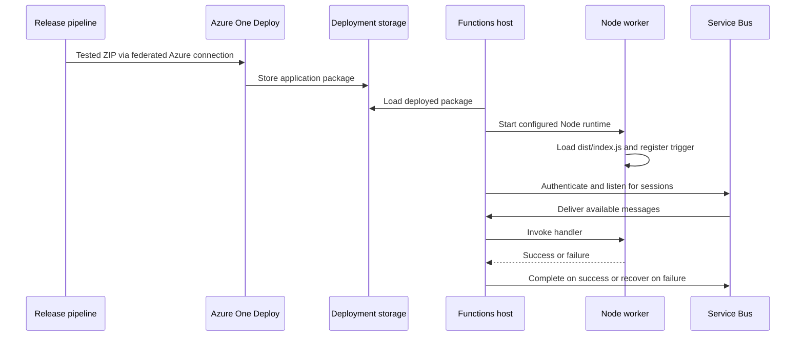
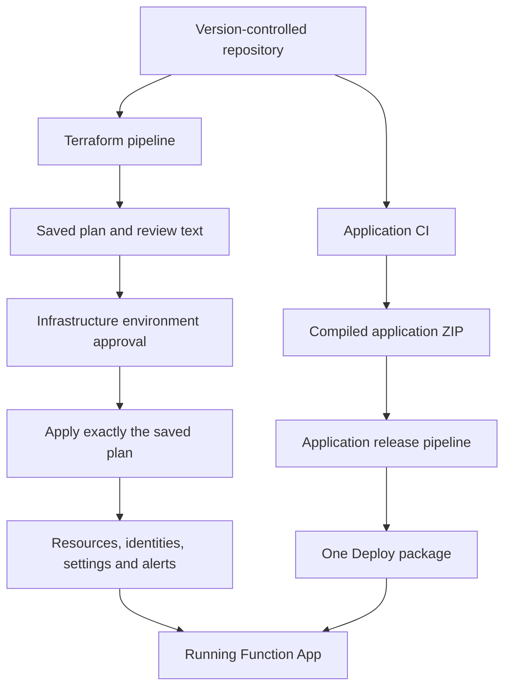
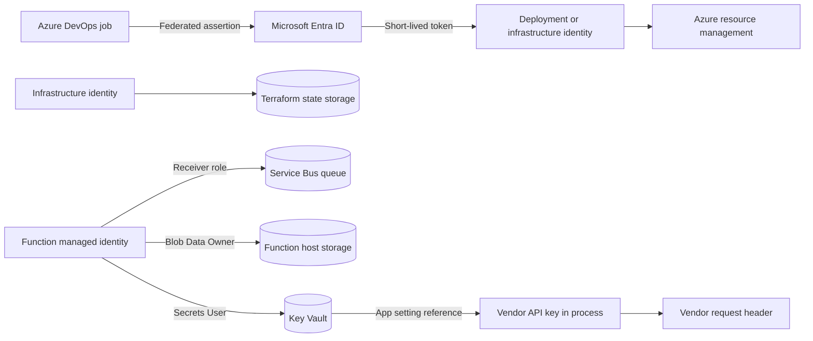
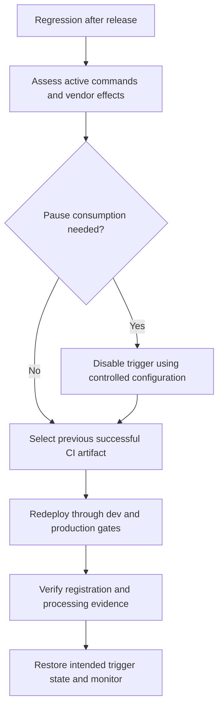

# Deployment and CI/CD proposal

## Proposed company design

Use Azure Functions v4 on Linux Flex Consumption with Node.js 24. Use Terraform for Azure resources and configuration; use Azure DevOps to build, test and deploy application packages. This keeps infrastructure changes reviewable and lets a tested application artifact move through environments without rebuilding it.

These are executable examples after setup, not a claim that the company's Azure landing zone, identities, approvals or pipelines already exist. Azure DevOps is the selected example because this is an Azure service; the same artifact/state separation works in GitHub Actions if that is the company's source platform.

```mermaid
flowchart LR
    Dev[Developer branch] --> PR[Pull request and review]
    PR --> CI[Build and safe tests]
    CI --> Merge[Protected main branch]
    Merge --> Artifact[Versioned function ZIP and checksum]
    Artifact --> DevDeploy[Development deployment]
    DevDeploy --> Acceptance[Development acceptance evidence]
    Acceptance --> Gate[Production environment approval]
    Gate --> Prod[Deploy same ZIP to production]
    Prod --> Observe[Monitor processing and errors]
```

## Azure runtime architecture

The Functions host manages trigger listening, session locks, invocation and message completion. The Node worker loads `dist/index.js`; importing the Azure adapter registers `forwardBatterySetpoints`. Azure executes the compiled JavaScript, not the original TypeScript. The broker triggers execution; this app does not expose an application HTTP endpoint for producers.

Flex is Microsoft's recommended serverless plan and uses One Deploy. It has no deployment slots. The sample uses separate dev/prod Function Apps. The production example requests one always-ready instance for lower cold-start latency; actual latency and capacity must be measured. [Flex hosting](https://learn.microsoft.com/en-us/azure/azure-functions/flex-consumption-plan), [deployment technology](https://learn.microsoft.com/en-us/azure/azure-functions/functions-deployment-technologies), [runtime versions](https://learn.microsoft.com/en-us/azure/azure-functions/supported-languages).

## Infrastructure and application ownership

Terraform owns the queue, Function App configuration, identities, roles, storage, Key Vault, monitoring and trigger activation setting. The application pipeline owns the code package. The configuration intentionally does not use Terraform `zip_deploy_file`, provisioners, `local-exec` or legacy `WEBSITE_RUN_FROM_PACKAGE` switches. Application rollback does not require rolling back infrastructure.

| Terraform example resource | Purpose |
| --- | --- |
| `azurerm_function_app_flex_consumption` and `azurerm_service_plan` | Node.js 24 execution on FC1 |
| `azurerm_servicebus_namespace` and queue | Standard tier, sessions, five-minute lock, delivery limit |
| `azurerm_storage_account` and container | Host metadata and deployment packages |
| `azurerm_key_vault` | Vendor credential reference; secret value supplied separately |
| Role assignments | Queue receive, host storage, secret read |
| Insights, workspace, alerts | Telemetry and initial operational notifications |

The pinned Terraform and AzureRM versions are a reproducible sample baseline, not a claim to be the latest releases. Upgrade them through reviewed dependency changes and validation. `.terraform.lock.hcl` files are committed; state and downloaded providers are ignored.

## Identity and secret flow

Separate infrastructure and deployment identities per environment. Infrastructure needs resource creation and role-assignment permissions at the chosen scope plus backend blob access. Deployment needs permissions to publish to the target Function App; it does not need the vendor key. The producer needs its own sender role. Runtime has a receiver role scoped to its queue and no sender role.

The sample uses a system-assigned Function identity. Its roles are assigned after the app exists; allow RBAC propagation before the first deployment/activation. Key Vault references use that identity. The key is not a Terraform input, resource or data-source value, so Terraform does not persist it in state. Secret operators supply `vendor-api-key` to the vault outside Terraform. [Identity-based trigger connections](https://learn.microsoft.com/en-us/azure/azure-functions/functions-bindings-service-bus-trigger), [Key Vault references](https://learn.microsoft.com/en-us/azure/app-service/app-service-key-vault-references).

## Configure the three pipelines

**CI — `azure-pipelines.yml`**

Create an Azure DevOps pipeline named `battery-forwarder-ci`. It compiles, runs safe tests, publishes JUnit results, stages only runtime files and production dependencies, and publishes `function.zip`, its SHA-256 and source commit. An independent job checks Terraform formatting and provider validation without using Azure credentials. For Azure Repos, configure build validation as a branch policy; YAML `pr` triggers alone do not provide Azure Repos PR validation.

**Infrastructure — `pipelines/infrastructure.yml`**

Create a manual pipeline from this file. Create federated Azure Resource Manager service connections `battery-dev-infra` and `battery-prod-infra`. Create variable groups `battery-dev-infra` and `battery-prod-infra` with:

| Variable | Example / meaning |
| --- | --- |
| `StateResourceGroup` | Existing state resource group |
| `StateStorageAccount` | Existing backend storage account |
| `SubscriptionId` | Target subscription UUID |
| `NamePrefix` | Globally unique lowercase name prefix |
| `Location` | `westeurope`, after checking availability |
| `VendorBaseUrl` | Approved HTTPS mock in dev; vendor in prod |
| `AlertEmail` | Team alert address |
| `EnableTrigger` | Initially `false`; deliberately activate later |
| `AlwaysReadyInstances` | `0` for dev, `1` as a production starting point |

Create environments `battery-dev-infra` and `battery-prod-infra`, restrict their pipelines/branches, and configure approvals on Apply. Review `infra-plan/review.txt` before approval. Apply downloads and uses the saved binary plan from the same run; it does not silently replan. Treat plan artifacts and state as sensitive operational data and restrict retention/access. If state changed since planning, Terraform rejects a stale plan; rerun and review it.

**Application release — `pipelines/release.yml`**

Create federated service connections `battery-dev-deploy` and `battery-prod-deploy`, and environments `battery-dev` and `battery-prod`. Set pipeline variables `DevFunctionApp`, `DevResourceGroup`, `ProdFunctionApp`, and `ProdResourceGroup` using Terraform outputs. Restrict the production environment to approved pipelines and protected branches and configure its reviewer check.

Choose a successful main-branch CI resource version when manually running a release. Both stages download the same CI artifact and verify its checksum/commit. A read-only API gate also verifies that the complete source CI run succeeded, so a package from a run with failed Terraform validation cannot be promoted. Grant the release job's Build Service identity permission to view source builds/artifacts; `System.AccessToken` is mapped only to that verification step. `AzureFunctionApp@2` uses `isFlexConsumption: true`. The post-deploy check verifies trigger registration; it does not send a live battery command. Review development acceptance evidence before approving production. Environment approval policies are configured in Azure DevOps, not silently created by YAML. [Azure Functions deployment task](https://learn.microsoft.com/en-us/azure/devops/pipelines/tasks/reference/azure-function-app-v2?view=azure-pipelines), [build verification API](https://learn.microsoft.com/en-us/rest/api/azure/devops/build/builds/get?view=azure-devops-rest-7.1).

```mermaid
flowchart LR
    CI[Successful main CI run] --> Artifact[ZIP plus checksum and commit]
    Artifact --> VerifyDev[Verify checksum in dev]
    VerifyDev --> DeployDev[Deploy to dev]
    DeployDev --> RegisterDev[Check trigger registration]
    RegisterDev --> Evidence[Review cloud acceptance evidence]
    Evidence --> Approval[Configured production approval]
    Approval --> VerifyProd[Verify same artifact]
    VerifyProd --> DeployProd[Deploy to prod]
    DeployProd --> RegisterProd[Check trigger registration and observe]
```

Protect release YAML and service connections as well as application code. A trusted artifact alone does not make an unreviewed release pipeline trusted. Source pipelines, selected artifacts and environment checks must all be covered by company access policy.

## Rollback and release behavior

Flex deployment may restart workers. Queue delivery makes commands durable but does not eliminate duplicates around in-flight HTTP calls. There are no slots in this design, and two active test/prod consumers must not share the production queue as an accidental canary.

For rollback, select a retained previous CI run in the same release pipeline; no code rebuild is needed. Confirm the old code remains compatible with current settings and queue contracts. An application rollback cannot undo a battery command already accepted by the vendor. Emergency configuration changes must be reconciled back into Terraform.

## Scope and proposed extensions

The sample uses authenticated public Azure endpoints and Standard Service Bus. A company landing zone may require private endpoints, Service Bus Premium, VNet integration, private DNS and a network-connected pipeline agent. Those are explicit landing-zone extensions, not provisioned here. The HTTPS mock in Azure, enterprise federation bootstrap and actual cloud acceptance automation also remain company setup tasks.

The Terraform configuration supplies initial dead-letter and failed-invocation alerts. Add measured queue-age objectives, vendor latency/rate metrics, operational dashboards and an agreed replay policy before production activation. Avoid treating Azure autoscaling as a vendor rate limiter.
