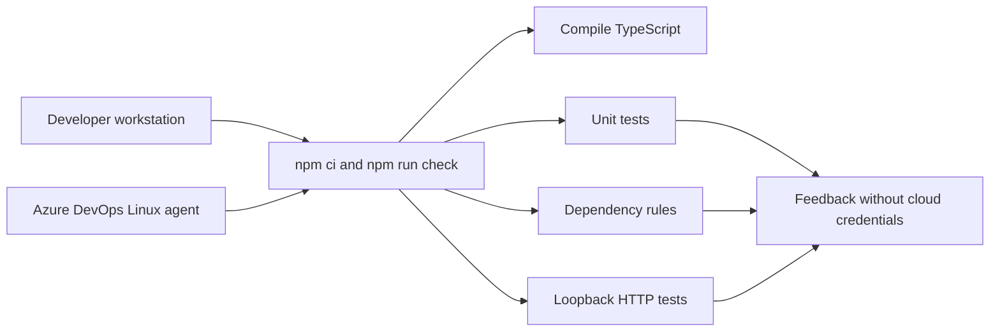
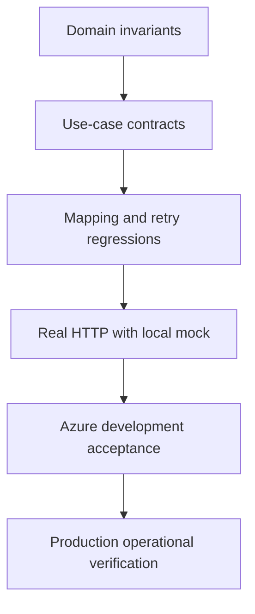
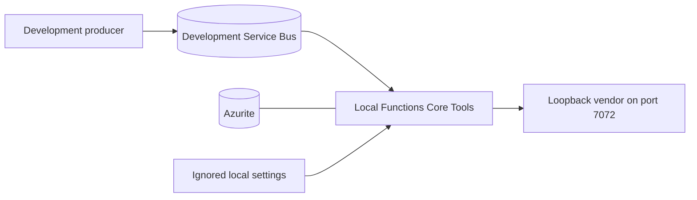

# Development and testing

## Same checks locally and in CI



Use Node.js 24 for alignment with Azure. Node.js 22 remains allowed for existing workstations. Use locked dependencies through `npm ci`. `npm run check` builds application source, type-checks tests and runs all safe tests. `npm run test:ci` runs the same tests with JUnit output. CI also runs `npm run typecheck:tests` before executing the suite.

| Location | Boundary tested | Dependencies |
| --- | --- | --- |
| `tests/unit/domain` | Domain invariants and immutable values | None |
| `tests/unit/application` | Use case and publisher port | Fake publisher |
| `tests/unit/infrastructure` | Mapping, filtering, retry classification and ordering | Mocked HTTP calls/logger |
| `tests/integration` | Real vendor HTTP adapter and release gate against a CI API fixture | In-process loopback servers |
| `tests/architecture` | Source dependency directions | Source inspection |
| Cloud scenarios below | Azure host, identity, sessions and settlement | Dedicated Azure dev resources |

The original 17 regression cases remain under `tests/unit/infrastructure/forwarding.test.ts`. Focused tests now also cover domain/application boundaries and actual HTTP. Integration tests choose an available port and close all server connections after each test; they need neither Azurite nor Service Bus.



## Local commands

```sh
npm ci
npm run check
npm run test:watch
```

For interactive HTTP inspection, run `npm run dev:vendor`. The mock listens at `http://127.0.0.1:7072`, accepts `POST /BB<number>/setpoint`, checks `Ocp-Apim-Subscription-Key: local-test-key`, and returns 204. `/health` returns 200. It is a development fixture and never contacts a real battery.

## Running the real Functions host

1. Copy `local.settings.example.json` to `local.settings.json`.
2. Start the mock vendor in one terminal.
3. Start separately installed Azurite for `UseDevelopmentStorage=true`.
4. Configure a dedicated session-enabled development queue named `sbq-batbat-spt`.
5. Supply a development connection string through `ServiceBusConnection`, or use identity authentication as described below.
6. Run `npm start` in another terminal.
7. Send the example message through an approved development producer with `SessionId=BB00001`.

The Terraform namespace disables local authentication. To use it from a workstation, remove the exact `ServiceBusConnection` string setting, add `ServiceBusConnection__fullyQualifiedNamespace`, and sign in through `az login`. Grant the developer `Azure Service Bus Data Receiver` on the dev queue. Omit the Azure-only `ServiceBusConnection__credential=managedidentity` override locally. Do not point a developer host at the production queue.



A broker emulator can be added if its session capabilities match the intended tests. This repository does not provide a complete cloud-equivalent broker emulator.

## Azure development acceptance

These tests are separate from `npm test`. An Azure Function cannot reach the workstation's loopback mock: provision an approved HTTPS mock in dev and configure its key before activating the trigger. The repository supplies the local fixture, not a hosted Azure mock service.

| Scenario | Expected evidence |
| --- | --- |
| Valid device | Mock receives authenticated path and converted body; invocation succeeds |
| Three commands for one device | Received order is preserved within session ownership |
| Different devices | Independent sessions make progress |
| Unknown device | Skip trace and no HTTP effect |
| Invalid accepted message | Invocation fails; repeated delivery eventually reaches DLQ |
| 429 followed by 204 | Bounded retry then successful completion |
| Repeated 500 | HTTP attempts exhaust and broker redelivers |
| Later failure in a batch | Earlier successful effect may repeat, matching the known limitation |
| Worker restart | Session ownership recovers; duplicates remain possible |
| Missing role or secret | Failure is visible in host/invocation telemetry |

Record build ID, commit, device/session IDs, UTC interval, mock observations and Application Insights evidence in the release review. The release pipeline automatically checks **trigger registration only**. Review development processing evidence at the production gate until cloud acceptance scenarios are automated.
