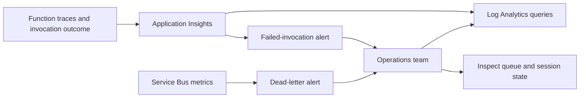
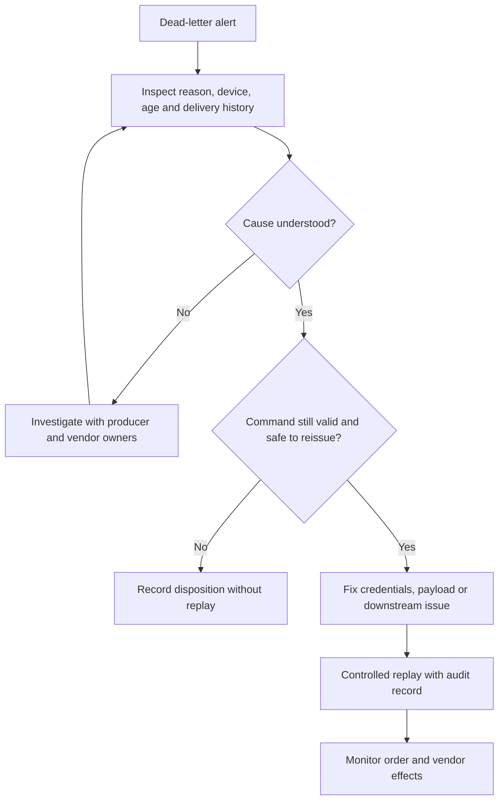

# Operations and production decisions

## First activation

Terraform defaults `enable_trigger=false`. Provisioning infrastructure and publishing a ZIP are separate from activating queue consumption.

```mermaid
flowchart LR
    Provision[Provision Terraform resources] --> Roles[Wait for identity permissions]
    Roles --> Secret[Populate vendor-api-key in Key Vault]
    Secret --> Deploy[Deploy tested application artifact]
    Deploy --> Verify[Verify settings and registered trigger]
    Verify --> Contract[Confirm queue, producer and vendor contract]
    Contract --> Enable[Apply enable_trigger=true]
    Enable --> Observe[Observe approved development commands]
```



1. Verify the endpoint is an approved dev mock or the intended production vendor.
2. Check the Key Vault reference resolves and the Function identity has queue/storage access.
3. Confirm the producer sets `SessionId=device_id` and uses the intended namespace.
4. Confirm the five accepted device IDs are correct for the environment.
5. Agree command expiry, duplicate handling, alert ownership and vendor traffic limits.
6. Activate in dev, collect cloud acceptance evidence, then use the production approval process.

The connection prefix changed to `ServiceBusConnection`. Remove obsolete exact connection-string settings when adopting the managed-identity prefix; an exact connection setting can take precedence over prefixed settings.

## Lock and execution budget

`host.json` caps batch size at five, disables prefetch and sets a four-minute function timeout. The Terraform queue has a five-minute lock and `MaxDeliveryCount=5`. One HTTP publication can consume about `3 × 8 seconds + 2 × 5 seconds = 34 seconds`; five successful-but-slow publications can approach 170 seconds, before host/network overhead. These are configured budgets, not an end-to-end latency guarantee. Existing external queues must be reviewed to match this configuration.

Microsoft documents that `maxAutoLockRenewalDuration` does not apply to batched triggers. `maxConcurrentSessions` likewise is documented for single-message session processing, so the sample does not pretend that setting controls this batch handler. Load-test the actual extension/runtime behavior. [Service Bus host settings](https://learn.microsoft.com/en-us/azure/azure-functions/functions-bindings-service-bus).

## Observe and diagnose

Terraform creates alerts for any dead-letter message and failed invocation within the configured window. Start with these, then tune thresholds after observing normal load. There is currently no custom metric for oldest queue age or vendor latency; add instrumentation and objectives as the workload becomes known.



Example Application Insights query:

```kusto
traces
| where timestamp > ago(1h)
| where message has_any ("Forwarded message", "Skipping message", "failed")
| project timestamp, operation_Id, severityLevel, message
| order by timestamp desc
```

When querying the workspace directly, use its `AppTraces` table and corresponding column names instead. Correlate failures by invocation/operation ID and device. Do not put vendor keys, full connection strings or entire Axios request configuration into logs. The adapter logs a sanitized error description.

## Dead-letter handling



Do not bulk replay automatically. The code rebuilds the start/end window from the current clock: an old command can become a new instruction. Re-enqueued messages get a new queue position, so original ordering relative to later commands is not retained. Record original message ID, reason, operator, time and replacement message ID. The repository supplies the runbook, not an automatic replay utility.

## Known limits and decisions

| Topic | Current implementation | Decision before production |
| --- | --- | --- |
| Duplicate effects | At-least-once batch processing; no durable deduplication | Vendor idempotency or reconciliation policy |
| Command age | Reuses original duration with a new start time | Expiry/TTL and stale-command policy |
| Device inventory | Fixed five-device allowlist | Confirm real inventory source and change process |
| Invalid messages | Fail and eventually dead-letter | Whether permanent validation failures need direct quarantine |
| 429 handling | Retry-After capped at five seconds | Confirm vendor permits this retry behavior |
| Throughput | Sequential per batch; multiple sessions/instances possible | Vendor capacity and coordinated rate limiting |
| Hosting | Flex, 2048 MB, scale ceiling 40 in sample | Measure load, quotas and desired latency |
| Availability | Single-region sample, no zone-redundancy design | Recovery objectives, regional failure and networking requirements |
| Releases | Separate apps; same retained artifact | Required approvals and incident procedure |

Terraform validation cannot establish Azure quota, region availability, naming availability, permissions, vendor reachability or real host behavior. A successful cloud plan/apply and development acceptance run are still needed.
