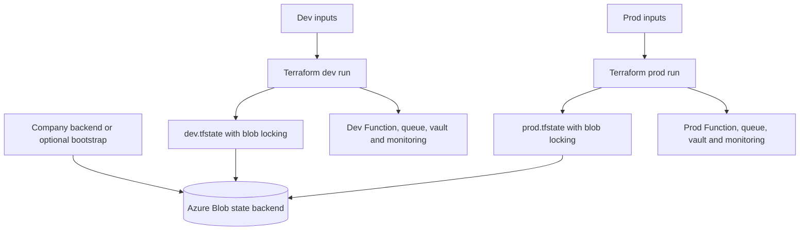

# Terraform sample: battery forwarder

This root configuration provisions one environment. Dev and prod use separate state keys and separate resource names; they can also use separate subscriptions. Application code is deployed by Azure DevOps after infrastructure exists.

## State and environment isolation



Prefer the company's existing backend. If none exists, `../bootstrap/` is a one-time example creating a state storage account with versioning, soft deletion and a destruction guard. It starts with local state because it cannot use a backend that does not yet exist. Protect that bootstrap state and migrate it into a separately managed company backend after creation. Do not casually destroy the bootstrap resources.

## Prerequisites and permissions

- Terraform 1.13.x; the sample installer uses 1.13.3. AzureRM is pinned to 4.48.0 and locked.
- Azure CLI for local `az login`, or the federated service connection used by CI.
- A subscription with Flex Consumption available in the chosen region and sufficient quota.
- Registered providers for Web, Storage, ServiceBus, KeyVault, Insights and OperationalInsights, or permission for the provider to register them.
- Infrastructure identity: resource management permissions and ability to assign the specified RBAC roles at the target scope. Creating the example resource group requires suitable subscription scope; adapt to an existing landing-zone group if company policy requires it.
- Backend identity: `Storage Blob Data Contributor` on the state account/container. Read-only validation needs none of these Azure permissions.
- Secret operator: permission to set secrets in the new vault. The app receives only `Key Vault Secrets User`.
- Producer/developer: separately assigned sender/receiver permissions on the appropriate queue. They are not created by this module.

The host gets `Storage Blob Data Owner` on its own storage account, also covering deployment blob access. New trigger types may require additional storage roles. No account-key or Service Bus connection-string credentials are generated for application use.

## Validate without Azure

```sh
terraform fmt -check -recursive infra
terraform -chdir=infra/terraform init -backend=false -input=false -lockfile=readonly
terraform -chdir=infra/terraform validate
```

Run from repository root. `init` downloads providers; `validate` checks configuration/provider schemas but does not prove deployability in a subscription.

## Configure and plan locally

Copy `environments/dev.tfvars.example` to `environments/dev.tfvars`, and `environments/dev.backend.hcl.example` to `environments/dev.backend.hcl`. Replace every placeholder. Real `.tfvars` and `.backend.hcl` files are ignored. Backend files contain configuration rather than credentials; never put secrets in them.

```sh
az login
terraform -chdir=infra/terraform init -reconfigure -backend-config=environments/dev.backend.hcl
terraform -chdir=infra/terraform plan -var-file=environments/dev.tfvars -out=dev.tfplan
terraform -chdir=infra/terraform show dev.tfplan
terraform -chdir=infra/terraform apply dev.tfplan
terraform -chdir=infra/terraform output
```

Review the concrete plan before applying. Use the corresponding prod files in a separate checkout/CI job, or reinitialize explicitly with the prod backend. Do not switch variable files while accidentally retaining the dev backend. The pipeline uses a fresh job and an explicit environment state key.

## Inputs and outputs

| Input | Meaning |
| --- | --- |
| `subscription_id` | Target subscription |
| `name_prefix` | Globally unique 3–12 character lowercase prefix |
| `environment` | `dev` or `prod` |
| `location` | Azure region, default `westeurope` |
| `vendor_base_url` | HTTPS mock in dev, intended vendor in prod |
| `enable_trigger` | Defaults false; separate deliberate activation |
| `always_ready_instances` | Zero in dev example, one in prod example |
| `alert_email` | Operational notification destination |
| `tags` | Company ownership/cost metadata |

Outputs provide Function name, resource group, queue/namespace, vault, Insights resource and runtime principal ID. Copy the app/group outputs into release pipeline variables.

After apply, populate the vault secret named `vendor-api-key` using the company's secret-management process. Do not create it using a Terraform secret resource/data source if avoiding secret values in state is a requirement. Wait for role propagation and verify the Key Vault reference before enabling consumption.

The sample pins `maximum_instance_count=40`, uses Standard Service Bus, authenticated public endpoints, and LRS application storage. These are explicit starting choices, not the final enterprise availability/network design. Review capacity, allowed egress, private networking and storage redundancy with the platform team.

See [deployment and CI/CD](../../docs/deployment-and-cicd.md) for the three Azure DevOps pipelines and [operations](../../docs/operations.md) for activation/rollback. Resource schemas were based on the [AzureRM Flex Function documentation](https://registry.terraform.io/providers/hashicorp/azurerm/4.48.0/docs/resources/function_app_flex_consumption) and [Microsoft's Terraform guidance](https://learn.microsoft.com/en-us/azure/azure-functions/functions-create-first-function-terraform).
